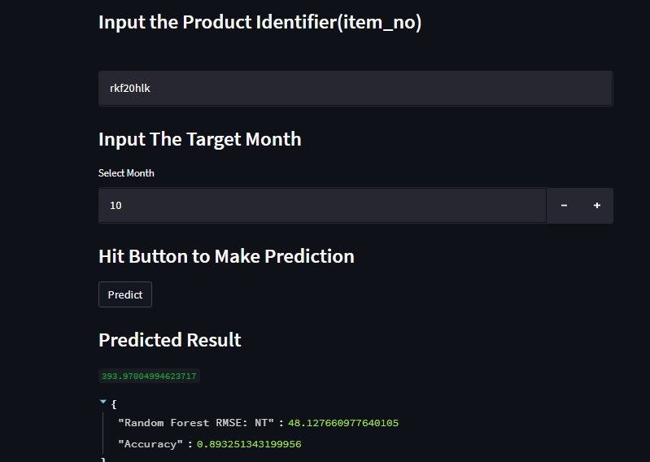

# AMS_prediction

1.1 **Overview**
The repository forms the processes followed in predicting the average monthly sales of items at a given depot. It hosts codes contained in diferent files. 

2.1 **app.py**
The app.py contains in details the API codes by calling the model.py. The app.py hosts codes used to deploy a basic Streamlit web application(a simple and powerful app model that lets you build rich UIs incredibly quickly). 

<a href = 'https://chibuikem01-ams-prediction-app-xicroh.streamlit.app/'>Link to API Endpoint<a/>
 
3.1 **The Machine Learning Process**
 The data was first loaded into a jupyter notebook for an extensive analysis of the dataset. The dataset comprised of 4628 rows and 7 columns(features).
 With and extensive descriptive analysis, there were normissing values found to be contained in the data.
 
3.2 **Data Features**
 The seven(7) features found in the data were 'region', 'depot', 'item_no', 'tms', 'ams', 'month', and 'year'.
 
3.2.1 **region**
 The region was found to contain observations all within the South-Western part of Nigeria.
 
3.2.2 **Depot**
 The depot column was found to contain a total of 21 distinct observations, namely: 'FUNT', 'ABEOKUTA', 'ADO EKITI', 'AGBOR', 'AKURE', 'BENIN',
 'EKPOMA', 'IBADAN', 'IJEBU', 'IKARE AKOKO', 'ILORIN', 'ISEYIN','IWO', 'LOKOJA', 'OGBOMOSHO', 'OKENE', 'ONDO', 'OSHOGBO',
 'SHAGAMU', 'SHAKI', 'WARRI'.
 
3.2.3 **Item_no**
 From the analysis, this feature was found to contain 23 unique items all inluding: '10063228', '10040447', '10056877', '10080907', '10081184',
'10090361', '10097797', '10098890', '108880', '10980611','10983534', '113441', 'BHF20HLK', 'D108881', 'HIT20NG', 'PMF20HLK', 'PMM20HLK', 'RKF20HLK', 'RSF20HLK', 'TB00004', '10047371','10109644', '10063348'. This item_no represents the respective items sold at different depot at different amounts.
 
3.2.4 **tms**
The tms feature, known as the total monthly sales represents the amount a particular item at a given depot was sold within a particular month. This feature was found to contain predominantly of zero(0.0)values. From the analysis,**0.0** appeared a total of **1496** times.
 
3.2.5 **ams**
The average monthly sales, known also as the target variable i.e The feature to be predicted after the training phase of the dataset has been achieved. The ams column was derived from the tms column by dividing each value within the tms column by 2.
 
3.2.6 **month**
 From the analysis, a total of 12months were present in the dataset. The months are represented with numbers ranging from 1 to 12, with 1 as January, 2 as February and 12 as December. e.t.c
 
3.2.7 **Year**
 The year column only  contained information for the year 2022.
 
4.1 **Exploratory Data Analysis(EDA)**
The EDA comprised of both descriptive and non descriptive analysis. Of the seven variables, 3 out of them were found to be categorical(region, depot, item_no), 2 were found to be of float datatype(tms, ams) and 2 were also found to be of int datatypes(month, year). The target variable(ams) being a continuous variable suggess that a regression analysis of a supervised learning would be carried out.
 Using a correlation heatmap, it was found that there was more less no correlation between each predictor variable and the target variable except for the tms column which was as a result of the fact that the ams feature was produced from it.
 
5.1 **Feature Engineering**
 Instead of dropping the the categorical variables, they were engineered by encoding each values with a label encoder object. The Label encoder was only instantiated for the features of the depot and and item_no only. Since the region was predominantly the South-West region, it depicts the absence of **variance** and hence was dropped as it would only appear to be redundant thereby causing noise during the fitting of the model.
 
 Previously before using a label encoder object, the categorical variables were first engineered by getting dmmies for each category(pd.get_dummies).it resulted to an increase of the features from **7** to **43**(course of dimensionality). Different models were trained on the new dataset(dummies) but  performed poorly when they were tested on unseen test data.
 
6.1 **Preprocessing**
 After all analysis have been carried out, the models were only trained on three variables i.e The depot feature, the item_no feature and the month feature, making it a total of three(3) predictor variables.
 
7.1 **Model Complexity**
 It should be noted that the model trained on the resulting dataset appear to be more dynamic rather than static in the sense that the model is trained on dataset of three previous months and a prediction is made on the following month i.e A querry of the dataset to retrieve information for the months of **march, april, and may(3rd, 4th and 5th month)** would be made and a model would be trained on that querry and finally making prediction for the ams for the month of **june(6th month)**
 
8.1 **Model Selection**
 Two models were used to train the data andt the  rmse(root mean square)value  was the metric used to evaluate the performance of the models. The two models used are the Linear regression  algorithm and a random forest algorithm. From every indications, the random forest appeared to have performed way better than the linear model. The assumption would be that the linear regression would have performed poorly as a result of no linear realtionship existing between the predictor variables and the target variables.
 

9.1 **model.py**
 The model.py contains the codes used in the data preprocessing and modeling stage. The variables used to predict the the Average monthly sales are the months,item_no and depot. 
 
10.1 **model deployment**
The link to make predictions : <a href = 'https://chibuikem01-ams-prediction-app-xicroh.streamlit.app/'>Link to API Endpoint<a/>
 
The model's api was deployed and hosted on Streamlit app to retrieve a url where predictions could be made for the average monthly sales. 
Below is the api interface where the various inputs are required for a prediction.

   
    

Th
